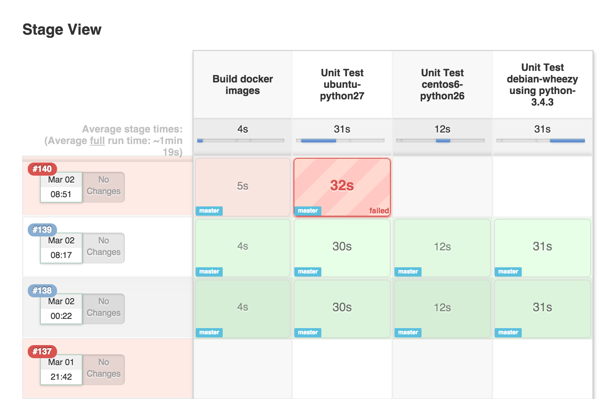

# Jenkins: Jobs, Pipelines, CI/CD and DevOps for Beginners

Comprehensive Jenkins course for beginners, meticulously crafted to empower developers and IT professionals with the tools and knowledge to master Continuous Integration (CI), Continuous Deployment (CD), and DevOps practices.

## Course Highlights

* **Foundational Knowledge:** Essentials of Jenkins, understanding its architecture, installation process, and the creation of your first pipeline.

* **Hands-On Experience:** Practical exercises from the start, setting up your first Jenkins job, troubleshooting pipelines, and learning how to manage builds and artifacts effectively.

* **Continuous Integration Mastery:** Proficiency in CI by learning how to set up build triggers, integrate with GitHub, and utilize Docker for build environments. Master the art of running tests, publishing reports, and ensuring code quality with real-world assignments.

* **Advanced Continuous Deployment:** Advanced CD techniques, including manual and automated deployments to production and staging environments. Manage secrets, use credentials in pipelines, and improve pipeline performance for a seamless deployment process.

* **Deployment with AWS:** Discover the nuances of deploying applications to AWS, from using S3 for storage to deploying dockerized applications with AWS Elastic Beanstalk.

* **Troubleshooting and Optimization:** Techniques for common Jenkins issues and how to optimize pipeline performance using caching, proper Docker images, and pipeline restructuring.

---

# Index
- [Introduction](#introduction)
- [Setup](#setup)
  - [Step 1](#step-1)
  - [Step 2](#step-2)
  - [Step 3](#step-3)
  - [Step 4](#step-4)
  - [Step 5](#step-5)
  - [Removing Jenkins](#removing-jenkins)
- [Plugins](#plugins)
  - [Pipeline: Stage View](#stage-view)
- [Jobs](#jobs)

---

# Introduction

**Jenkins** is a free and open source automation server used to automatically build and test software. Everytime someone writes or update a piece of software, Jenkins can compile it, run their tests, build a new version of the software, and deploy the app.

This means that Jenkins is a Continuous Integration (CI) and a Continuous Deployment (DC) tool.

---

# Setup

We will be using Jenkins in a Docker Container. For this, we need to follow the next steps:

## Step 1

Install Docker locally (can use Docker Desktop as an easiest approach).

## Step 2

Open a terminal window in the same directory were the `Dockerfile` is located and build the Jenkins Docker image:

`docker build -t my-jenkins .`

## Step 3

Start Jenkins:

`docker compose up -d`

## Step 4

Open Jenkins by going to his path (for this case, it is configured at http://localhost:8080/) and finish the instalation process.

## Step 5

To stop Jenkins, turn down the container by using the following command:

`docker compose down`

Then, we can turn on the container again using the same command as [Step 3](#step-3): `docker compose up -d`. 

## Removing Jenkins

Once we are done playing with Jenkins we can clean up things. By running the following command, we terminate Jenkins and remove all volumes and images used: 

`docker compose down --volumes --rmi all`

---

# Plugins

**Plugins** are extensions that enhance and personalize Jenkins capabilities. They add new features, integrate with other tools, and customize the user experience.

We can manage other plugins by going though the 'Administrate Jenkins' section.

## Stage View

Jenkins itself it a bunch of plugins, but one of them that is not included in the suggest list is **'Pipeline Stage View'**, which is an extended visualization of Pipeline build history on the index page of a flow project, under Stage View.

---

# Jobs

Jenkins uses projects (also known as "jobs") to perform its work. They are defined and run by Jenkins users, since there are different types of jobs, including:

* Pipeline
* Multibranch Pipeline
* Organization folders
* Freestyle
* Multi-configuration (matrix)
* Maven
* External job